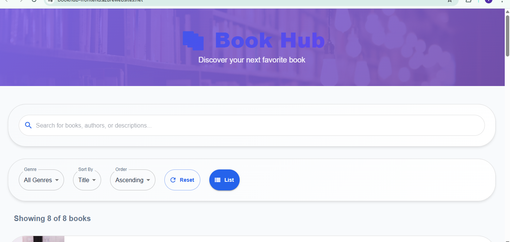

# Phase 2 – BookHub Submission

**Deployed Frontend URL:**  
<https://bookhub-frontend.azurewebsites.net>

## 📸 Screenshots

 

### 🔗 Pull Request  

[GitHub PR Link](https://github.com/Ange-Mukundente/agricare-planner/pull/34)

---

### Reflection on Docker and Deployment

- I containerized both frontend and backend using Docker and ran them using Docker Compose.
- I faced issues with PostgreSQL not connecting initially but fixed it by checking port bindings and readiness logic.
- TypeScript also threw errors (like `TS1484`) which I solved by converting type imports to type-only imports.
- I deployed my frontend on [Azure/Vercel] and linked it with my backend.
- Overall, I learned how to orchestrate a fullstack app in Docker and how to handle common deployment issues.
